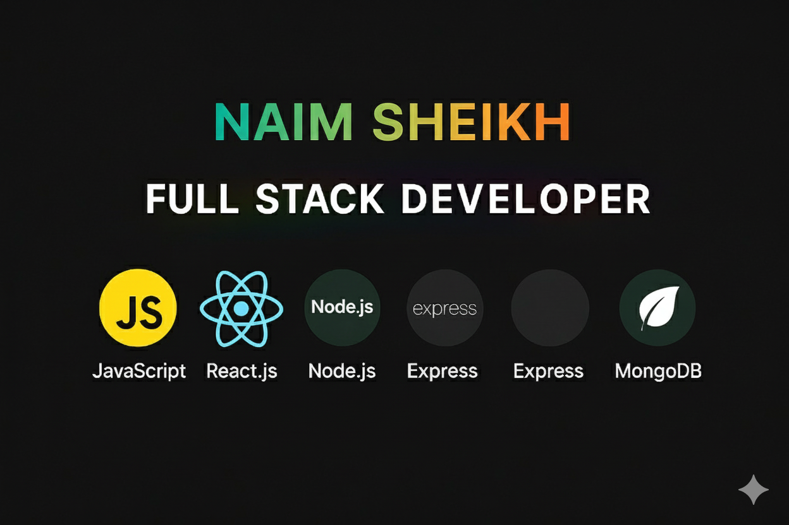

# Hi 👋, I'm Naim Sheikh
### A passionate MERN Developer from Bangladesh

---

## 🌐 Socials:
 
 

###

  

# 💻 Tech Stack:
 
 
 
 
 
 
 
 
 
 
 
 
 
 
 
 
 
 
 
 
 
 
 

---

### 🔹 Others  
 
 
 
 
 
 
 
 
 
 
 
 
 
 
 
 
 

🔭 I’m currently working on [Microworker Project](https://microworker-bd.netlify.app/)  
👨‍💻 All of my projects are available on [GitHub](https://github.com/naimsheikh8020)  
💬 Ask me about: **JavaScript, React.js**  
📫 How to reach me: *mdjuyelrana.com.bd1@gmail.com*  
📄 [Know about my experiences](https://drive.google.com/file/d/1dvN4cJwLwY1rrVUjmozqV1KTs3u2Y45F/view?usp=sharing)  

# 📊 GitHub Stats:
 
 

## 🏆 GitHub Trophies

---

<!-- Proudly created with GPRM ( https://gprm.itsvg.in ) -->

